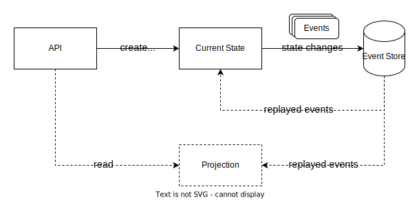

# Talk

--

### Patterns

- Command Query Responsibility Segregation (CQRS)
- Event Sourcing (ES)
- Domain Driven Design (DDD)

--

### Command Query Responsibility Segregation

Separate the read and write side of your application. Each side can now be optimise based on its unique characteristics.

- Read side should never cause side effects or state changes
- Allows for different read side data models (UI, Search, Reporting)
- Allows for independent scale of read and writes
- Allows for different technology (write to SQL, read from DocumentDB)

--

### Command Query Responsibility Segregation

Common Terms

- **Command** - instructions to change the system (causes side effects)
- **Query** - requests to read from the system (no side effects)

--

### Command Query Responsibility Segregation

--

### Event Sourcing

Represent your application state changes as a series of ordered events. Read the events to replay the state changes and produce the current application state.

- Allows replaying the events into different data models
- Naturally creates an audit trail (each event contains who/what/why)
- Allows point-in-time queries
- Debugging state changes is easier

--

### Event Sourcing

Common Terms

- **Event** - representation of a state change
- **Event Stream** - ordered list of events
- **Projection** - events replayed into a data model
- **Temporal Query** - replay events up to a point-in-time

--

### Event Sourcing

--

### Domain Driven Design

Represent the core problem domain of your application as a well-defined and expressive domain model. Specific contexts within the domain are segregated to allow each to specialise.

- Requires common language between developers and business users
- Aimed at improving software quality by more closely aligning with the business
- Domain models encapsulate the data and behaviour for a given context
- The same concept may have different language in each context (e.g. customer vs account)

--

### Domain Driven Design

Common Terms

- **Bounded Context** - logical boundaries between domain models
- **Entity** - data where the ID matters
- **Value Object** - data where the value matters
- **Aggregate** - collection of Entities and Value Objects
- **Aggregate Root** - the top node in an object tree; entry point; transactional boundary
- **Domain Event** - meaningful business change in the system
- **Repository** - retrieve and store domain models
- **Factories** - control the creation of domain models
- **Services** - business logic that doesn't fit into any single Entity or Aggregate
- **Ubiquitous Language** - common language between developers and business users

--

### Domain Driven Design

--

### Domain Driven Design

--

### Domain Driven Design

--

### Mix and Match

Any combination of these patterns are possible.

--

### Mix and Match

--

### Mix and Match

--

### Mix and Match

--

### Mix and Match

--

### What's Next?

What other patterns do you want covered in the future?

--